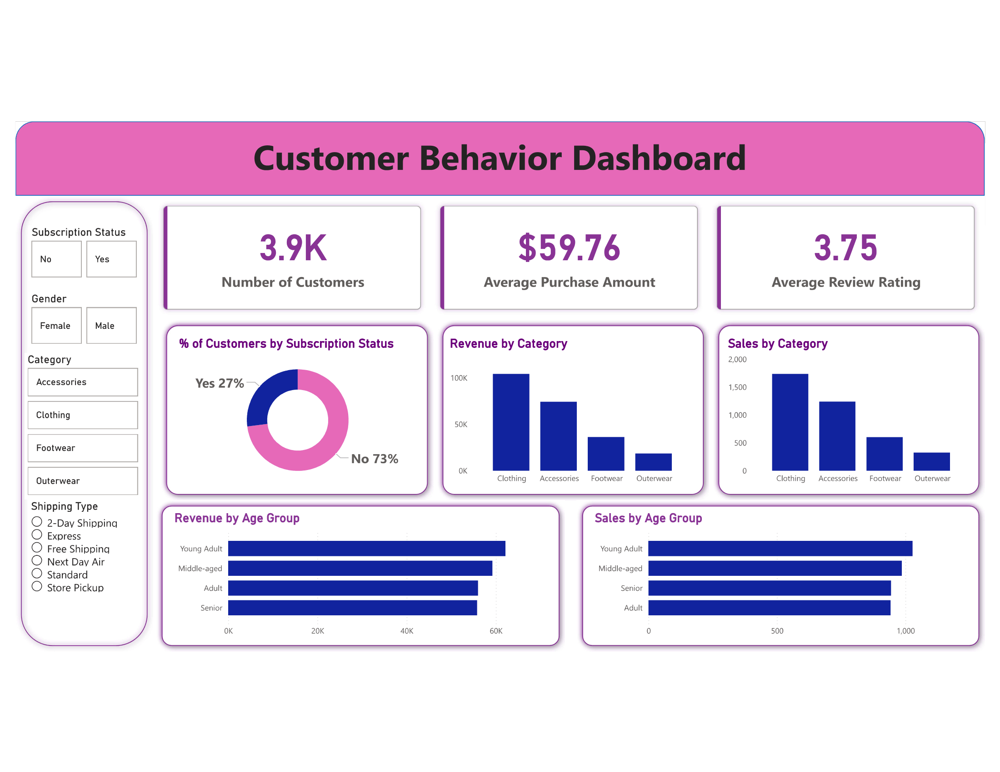

# Customer Behavior Dashboard 📊

An interactive Power BI dashboard analyzing customer shopping behavior across demographics, product categories, and shipping preferences.

## 🔗 Live Dashboard
> Open the `.pbix` file in Power BI Desktop to explore the interactive dashboard.

## 📌 Project Overview
This project analyzes a dataset of 3,900+ customers to uncover purchasing patterns, revenue distribution, and customer segmentation insights — enabling data-driven business decisions in retail.

## 📊 Key Metrics
| Metric | Value |
|---|---|
| Total Customers | 3,900+ |
| Average Purchase Amount | $59.76 |
| Average Review Rating | 3.75 / 5 |
| Subscription Rate | 27% |

## 🔍 Key Insights
- **Clothing** is the top-performing category by both revenue and sales volume
- **Young Adults** are the highest-spending age group, followed by Middle-aged customers
- **73%** of customers are non-subscribers — potential target for subscription campaigns
- Revenue and sales trends are consistent across categories, indicating stable demand

## 📁 Files
| File | Description |
|---|---|
| `customer_behavior_dashboard.pbix` | Power BI dashboard file |
| `customer_shopping_behavior.csv` | Raw dataset |
| `dashboard_screenshot.png` | Dashboard preview |

## 🛠️ Tools Used
- **Power BI** — Dashboard development, DAX, Power Query
- **Data Modeling** — Relationships and calculated measures
- **DAX** — Custom KPI calculations

## 📷 Dashboard Preview

## 📂 Dataset Features
- Customer demographics (Age Group, Gender)
- Purchase amount and product category
- Subscription status
- Shipping type preferences
- Review ratings

## 👤 Author
**Deepanshu Mohanty**  
[LinkedIn](https://www.linkedin.com/in/deepanshu-mohanty-00b6b4266) | [GitHub](https://github.com/Deepanshu4284)
